# FoodFeed

## Contents

* [Purpose and Value](#purpose-and-value)
  * [Application Purpose](#application-purpose)
  * [User Value](#user-value)

* [Design](#design)
  * [Ideation](#ideation)
  * [Wireframes](#wireframes)
  * [Database Structure](#database-structure)
    * [Post and Comment Models](#post-and-comment-models)
    * [User Profile Model](#user-profile-model)
    * [User Profile Model Additional Details](#user-profile-model-additional-details)
  * [Deployment Procedure](#deployment-procedure)

* [Website Features](#website-features)
  * [Overview of General Features](#overview-of-general-features)
  * [Interacting with the Site](#interacting-with-the-site)
    * [Navigation Bar](#navigation-bar)
    * [User Profile Buttons](#user-profile-page-buttons)
    * [Post and Comment Buttons](#post-and-comment-buttons)
    * [Additional Buttons](#additional-buttons)
  * [User Profile CRUD Features](#user-profile-crud-features)
  * [Post and Comment CRUD Features](#post-and-comment-crud-features)

* [File Validation](#file-validation)

* [Testing](#testing)
  * [Site Evaluations](#site-evaluations)
  * [Automated Test Suite](#automated-test-suite)
    * [Forms](#forms)
    * [Post and Comment Views](#post-and-comment-views)
    * [User and User Profile Views](#user-and-user-profile-views)
  * [Manual Testing](#manual-testing)

* [Credits](#credits)

* [AI Usage](#ai-usage)

- - -

## Purpose and Value

### Application Purpose
To demonstrate the ability to create a website where users can intuitively perform CRUD operations. For the purpose of showcasing features, it has pre-made content with posts, comments and users.

The site includes custom models for Posts, Comments as well as a User Profile that enables customisation of their username, profile picture and a bio.

### User Value

User stories were used to understand the features that would most benefit a user, first having those that would produce an MVP, and then incrementally adding the features believed to offer the most value.

They were labeled according to the MoSCoW prioritisation system according to the following principles:
* `must-have` stories would inform the MVP for the website.
* `should-have` stories would add additional core features.
* `could-have` stories would improve the user experience.

The MVP for this project was considered to be a basic social media feed wherein any user could browse all the posts ever made. They would be able to register for an account and then be able to create, edit and delete their own posts and comments. Additionally they would be able to create, update and delete an account profile picture.

This MVP would fulfil CRUD operations and be a functional website, however it would lack features enabling users to better navigate the site and engage with other users. To that end `should-have` stories, that would enable users to view individual posts and follow other users, were seen to be the most crucial. The `could-have` features would have similar motivations, but also would concern the functionality of the site as the amount of content scaled.

In the end, all `must-have` stories were completed, but the `should-have` ability to follow users and the `could-have` features did not have time to be implemented. An Agile approach to the site development means that, despite missing these desired features, the current site is functional and polished.

The project board can be accessed here: [FoodFeed project board](https://github.com/users/AmeliaBeep/projects/3/views/1)

## Design

### Ideation

The site name was chosen by considering the types of names other social media apps have. Many of their names are derived from core functionality or act as a call to action. As a social media app centred around sharing and engaging with posts about food, FoodFeed was chosen to reflect that: after all, it is a feed of food. Similarly, the logo styling was designed to emphasise the "Feed" portion of the name and highlight the way content is presented as a feed.

The culture of Facebook food groups such as [Roast My Ugly Vegan Food](https://www.facebook.com/groups/834483857375137/) and subreddits like [r/shittyfoodporn](https://www.reddit.com/r/shittyfoodporn/) inspired users stories around allowing users to filter posts to depending on the appearance and taste of the food. A user was envisioned to have the capacity to browse a feed of whatever combination of tags they want. For instance they could specifically seek "`ugly looking` but `tasty`" foods which is a popular post type in such communities. Whilst these particular features did not make it to the site, they still informed the `must-have` and `should-have` features that would be required to enable them.

### Wireframes

Structurally, the site was inspired by a mixture of Facebook, Reddit and Twitter, where they primarily all have a central feed and then supplementary features either on their navigation bar or on the sides of the main content.

Their sites adapt to smaller screen sizes by moving their sidebar content to navigation bar icons or drop‑down menus. For FoodFeed, it was similarly intended for the sidebar filters and follow list to become accessible through a dropdown found via icons that would prompt drop‑down menus.

| Layout     | Wireframe         |
| ----------- | :------------: |
| Main feed |  |
| A page to submit content |  |
| Profile page |  |

### Database Structure

The entity‑relationship diagram shows the relationships between the (default Django) User, User Profile, Post and Comment models.

  

#### Post and Comment Models

  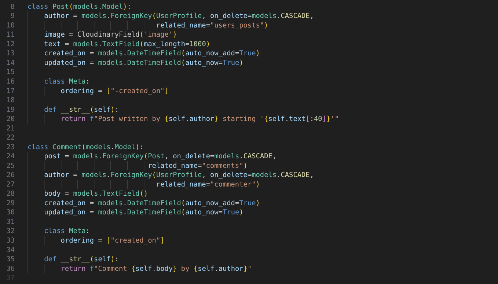

The Posts and Comment are similar to one another, with both having fields pertaining to an author and their specific content type. Users are able to perform full CRUD operations, being able to view posts and comments through feeds and also able to create, update, and delete their own instances of both.

Users are able to make and update their content through corresponding forms. Where fields are required, blank submissions are prevented from being posted. If this is bypassed and the request reaches the view handler functions, the submission will be rejected at that level.

It is worth noting that the `updated_on` field is not actually used in the site's current state, but I didn't want to remove it and its data from the model in anticipation of future changes.

#### User Profile Model

  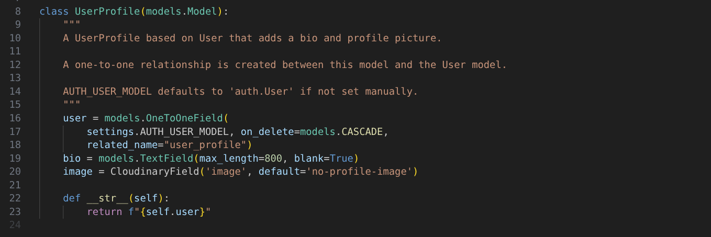

Users can also perform full CRUD operations on their User Profile image and bio to customise their profile pages. They can also update their associated username, which changes the username field associated with the (default Django) User model.

Users are able to make and update these profile details via a corresponding form accessed by the Edit Profile button visible on their profile page. Where fields are required, blank submissions are prevented from being posted. If this is bypassed and the request reaches the view handler functions, the submission will be rejected at that level.

#### User Profile Model Additional Details

I wanted users to have the ability to have profile pages with a username, bio, and image. The Django project settings provide the ability to provide a custom model to handle users, so creating a custom user model to replace the existing one would have worked. However, this felt like an overcomplicated solution to achieve what is effectively just wanting to add two extra fields to the pre-existing User model.

As the ERD diagram indicates, the approach used was to define an additional User Profile model with these additional fields. The User Profile can be considered the true representation of users, with User only being used to handle access control.

Currently whichever model is considered the author by posts and comments makes little difference, however I felt the User Profile would be more maintainable and scalable when considering future features. Features like display names, or profile pictures rendering in posts, all seemed to build on the User Profile model, so it made sense to choose that one in anticipation of future changes.

When users register to the website, the Django project uses the original User model to create a new user. This action (by default) sends a signal that the `create_user_profile` view function receives and responds to by creating a corresponding User Profile.

### Deployment Procedure

#### Overview

The site is hosted on Heroku, which required some configuration to enable it to work. The GitHub repository needed connecting to the Heroku application so that its content could be deployed. Automatic deployment is not configured, so manual deployments must be made to keep the site up to date.

Application configuration required:
* Set Heroku as an allowed host in the project settings.
* Create a Procfile supported by the gunicorn library.
* Handle static files with the WhiteNoise library.

Heroku configuration required:
* Add the `SECRET_KEY` environment variable to provide authorisation to the Django application.
* Add the `DATABASE_URL` to access the database.
* Add the `CLOUDINARY_URL` to access Cloudinary services.

#### Detailed Walkthrough

Prepare your Django application:
- Log in to GitHub and create a new repository for your project.
- Set up a basic Django application.
- Secure your environment variables:
  - Delete the value of the `SECRET_KEY` variable premade within the project directory's `settings.py`
  - Create an `env.py` file and declare a secure `SECRET_KEY` variable there.
  - Create a `.gitignore` file and add your `env.py` file to it so that your sensitive information won't get exposed.
  - In your project's `settings.py` have your `SECRET_KEY` take its value from your `env.py` file.
  - Add any additional sensitive to your `env.py` file such as any `DATABASE_URL` or `CLOUDINARY_URL` variables your application will rely on.
- Add a `Procfile` in the root of your project to later enable Heroku to run the site.
- Add, commit, and push your code to the GitHub repository so it can later be accessed by Heroku.

Configure your Heroku site:
- Log in to Heroku.
- Create an application:
  - From the Heroku dashboard, click New and then Create new app.
  - Give the app a unique name.
  - Choose an appropriate region for deployment.
- Add your environment variables to Heroku:
  - In the Heroku app dashboard, go to Settings and navigate to Config Vars.
  - Click to Reveal them and then copy your project's `SECRET_KEY` and any other variables defined in your `env.py` file.
- Connect Heroku to GitHub:
  - In your Heroku app dashboard, go to the Deploy tab.
  - Under Deployment method, select Connect to GitHub.
  - Authorise Heroku to access your GitHub account when prompted.
  - Search for and select the correct GitHub repository.
- Deploy the Django application:
  - Scroll down to the Manual Deploy section.
  - Select the branch you want to deploy (usually main or master).
  - Click Deploy Branch.
  - Wait for the build and deployment process to complete.
  - Access the live site through the View button shown when it has finsihed.

## Website Features

### Overview of General Features

Visitors to the site are able to browse the main feed, view specific posts and browse a user's profile page. They also have the ability to create their own account to then interact with content.

| Feature     | Mobile         | Desktop                   |
| ----------- | :------------: | :-----------------------: |
| View all content in a main feed |  | 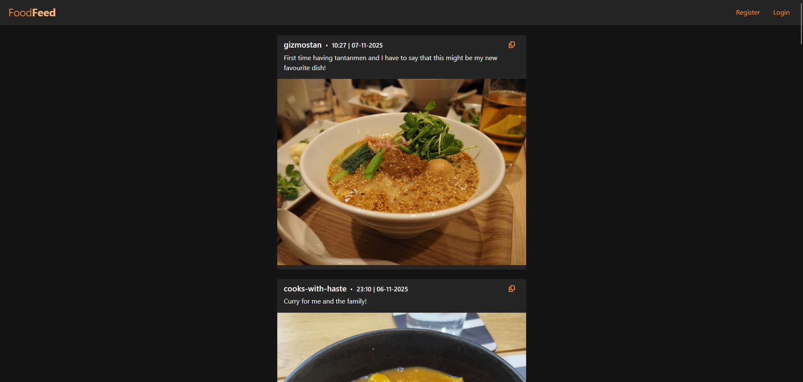 |
| Copy content's URL |  |  |
| View specific content |  |  |
| View user's profile page | 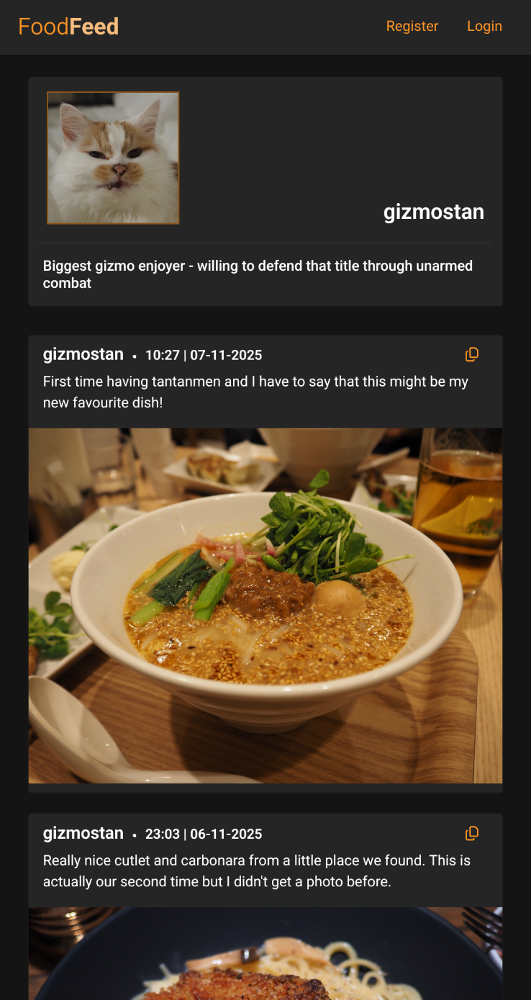 |  |
| Register an account |  |  |

### Interacting with the Site 

Navigation bar buttons indicate login status and enable users to register, log in, or log out. Signed‑in users also have the options to create a post and see their own profile. 

Site content provides the ability to visit user profiles by clicking an author's username. The copy button allows a user to get a URL that allows viewing of that specific content. Signed‑in authors get further buttons that allow them to edit or delete the content.

#### Navigation Bar
| UI element  | Images        |
| ----------- | :------------: |
| Navigation bar signed in |  |
| Navigation bar signed out | 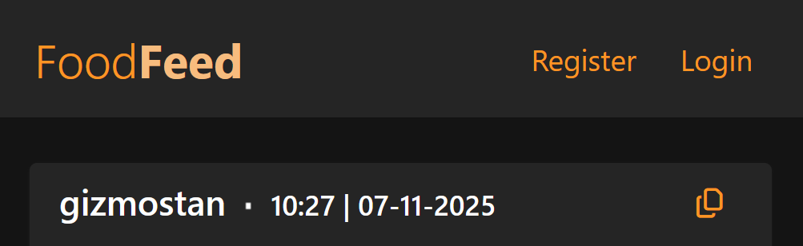 |
| Navigation account buttons | 
   
|

#### User Profile Page Buttons

Clicking the user icon, pictured in the table below, will take you to your profile page. From here you can click on the edit profile button to make changes to your profile username, image and bio as showcased later in the [User Profile CRUD features](#user-profile-crud-features) section.

| UI element  | Images        |
| ----------- | :------------: |
| View your profile page |  |
| Edit your profile page |  |

#### Post and Comment Buttons
| UI element  | Images        |
| ----------- | :------------: |
| Create a post |  |
| Create a comment | 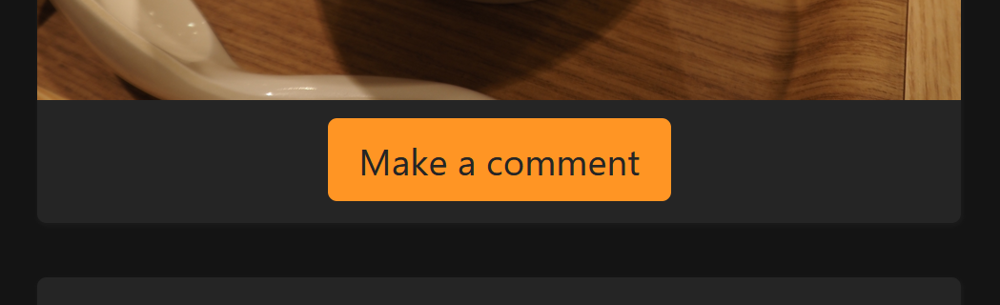 |
| Edit your content |  |
| Delete your content |  |

#### Additional Buttons

Clicking a content author's username will take you to their profile page. This can be another way to navigate to your own profile if you are the author of the post or comment.

| UI element  | Images        |
| ----------- | :------------: |
| View a content author's profile page |  |
| Copy content's URL |  |

### User Profile CRUD Features

Once a user has registered an account they have a profile page. From this page users can perform CRUD operations relating to the underlying custom User Profile model, allowing them to customise their username, image and bio through the Edit Profile button in their profile details section.

When a user creates an account they have a blank user profile with only their username. Their profile defaults to displaying the static [no-user-image](static/images/no-user-image.jpg) and having no bio section.

Their displayed name is sourced from the [Django User model](#user-profile-model-additional-details) username field and used in site authentication so, whilst they are free to update it, they are prevented from removing it completely. They are completely free to create, edit and delete their profile image and bio.

| Feature     | Mobile         | Desktop                   |
| ----------- | :------------: | :-----------------------: |
| Initial profile view |  | 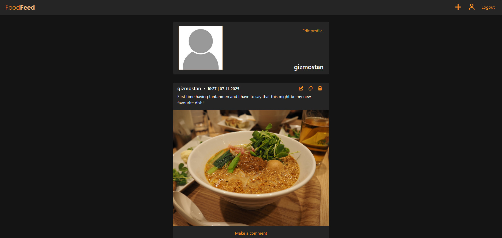 |
| Create profile details | 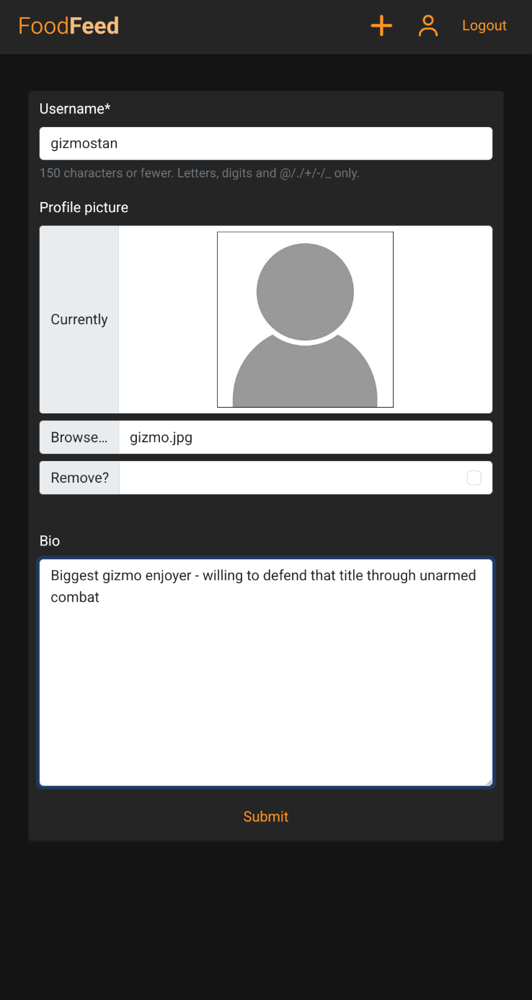 |  |
| Create results | 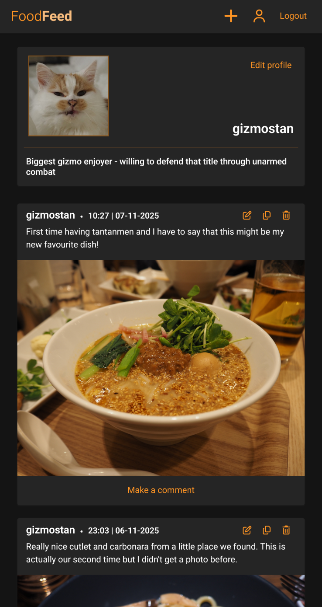 |  |
| Edit profile details |  | 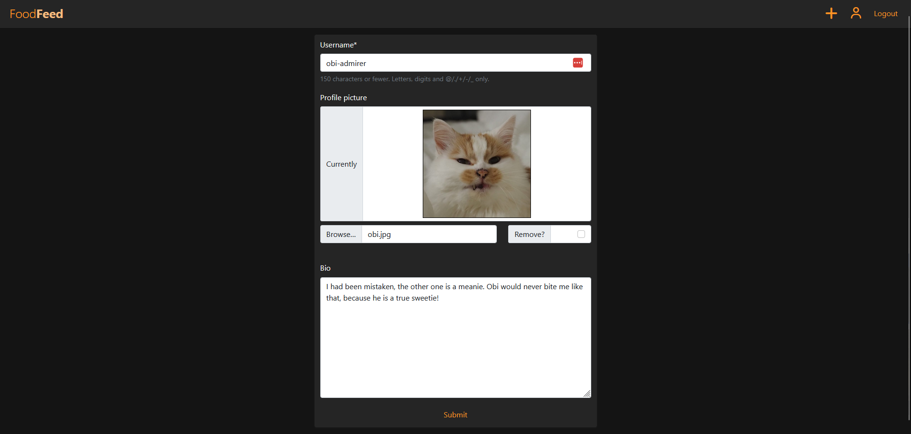 |
| Edit results |  |  |
| Delete profile details |  | 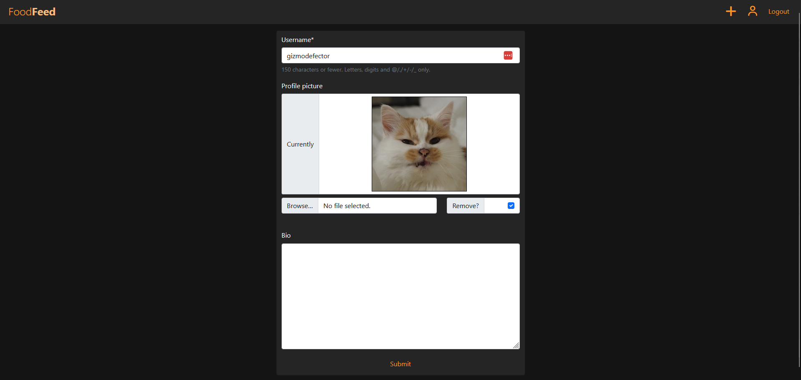 |
| Delete profile picture confirm | 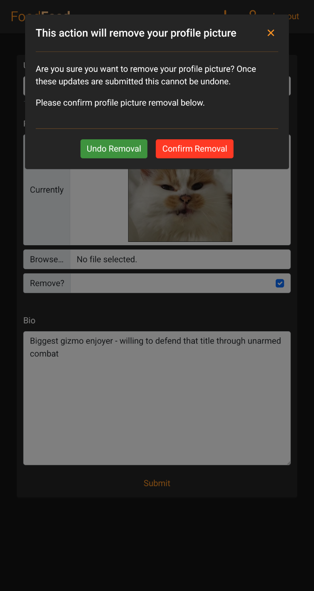 | 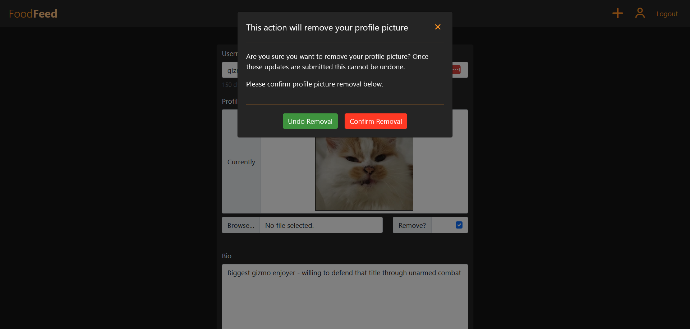 |
| Delete results | 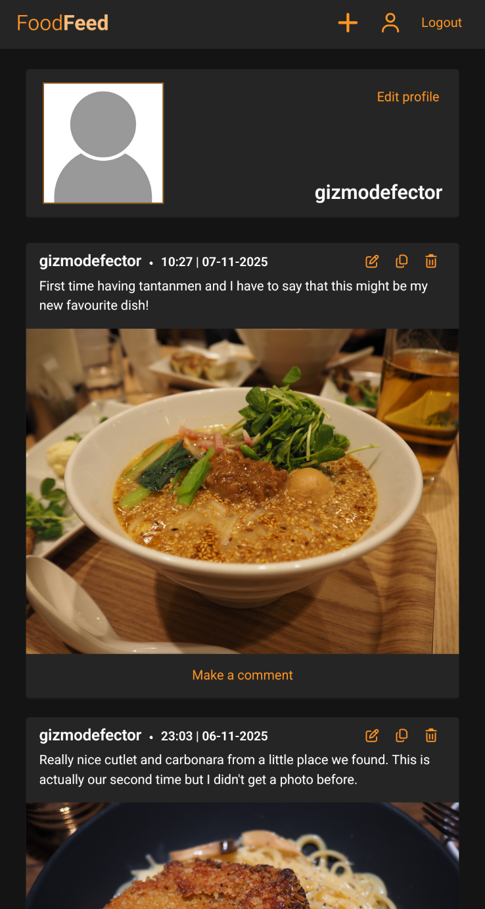 | 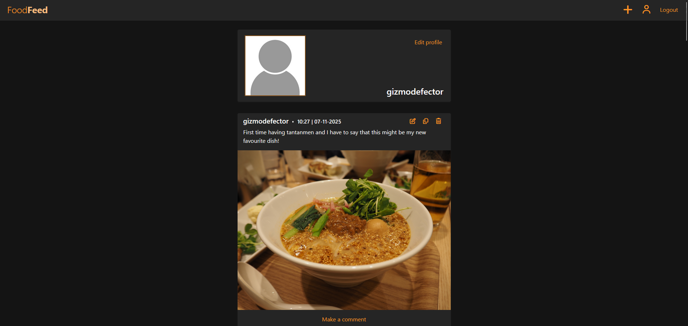 |

### Post and Comment CRUD Features

Users have the ability to create, update and delete their posts and comments. They can use [site buttons](#interacting-with-the-site) to access pages with forms, or the delete modal in the case of deletion.

| Feature     | Mobile         | Desktop                   |
| ----------- | :------------: | :-----------------------: |
| Create posts |  | 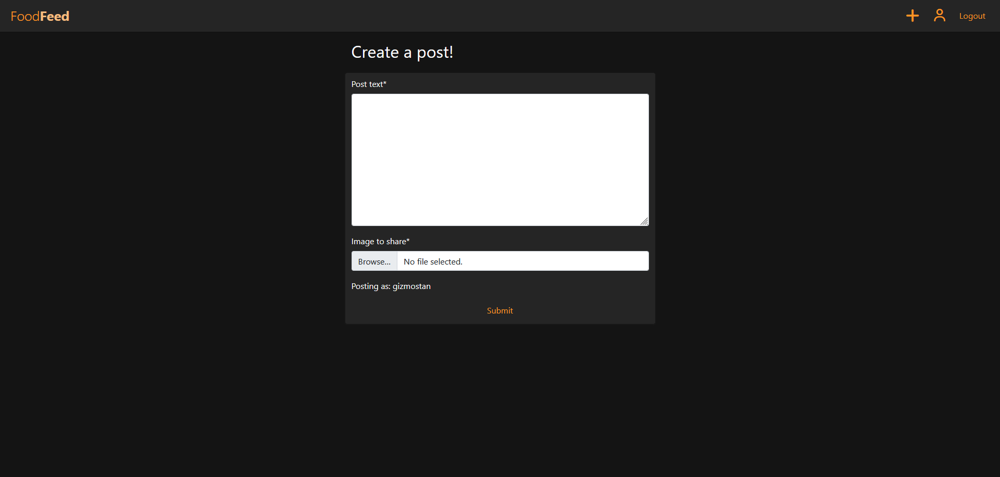 |
| Edit posts |  |  |
| Delete posts |  |  |
| Create comments | 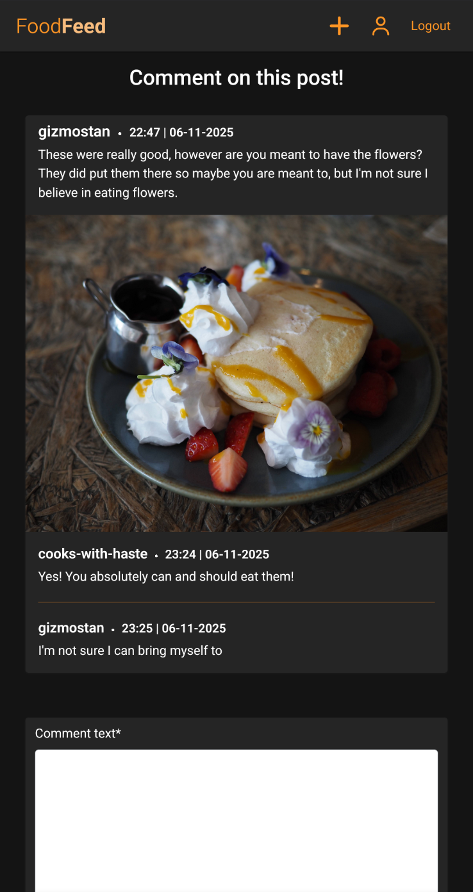 |  |
| Edit comments | 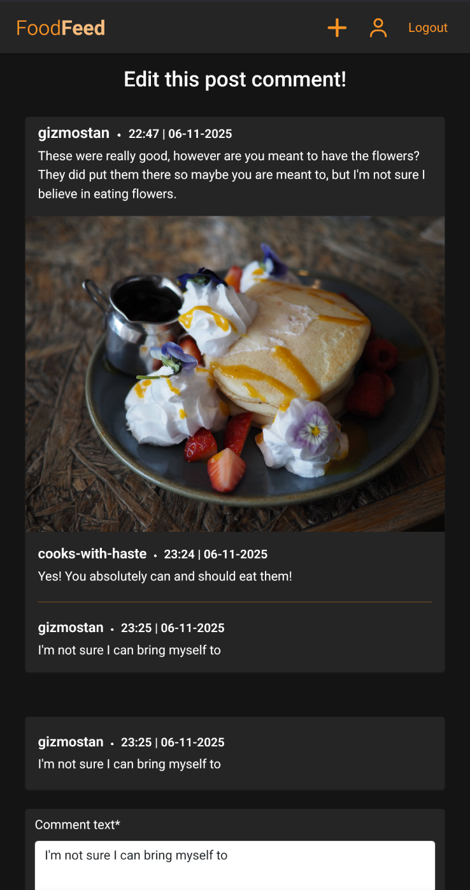 | 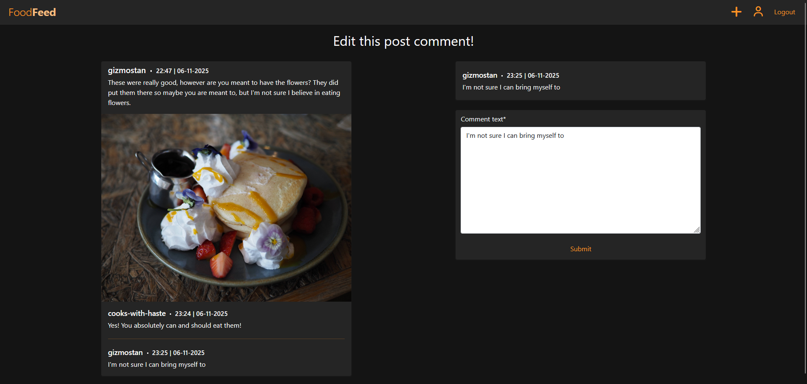 |
| Delete comments |  | 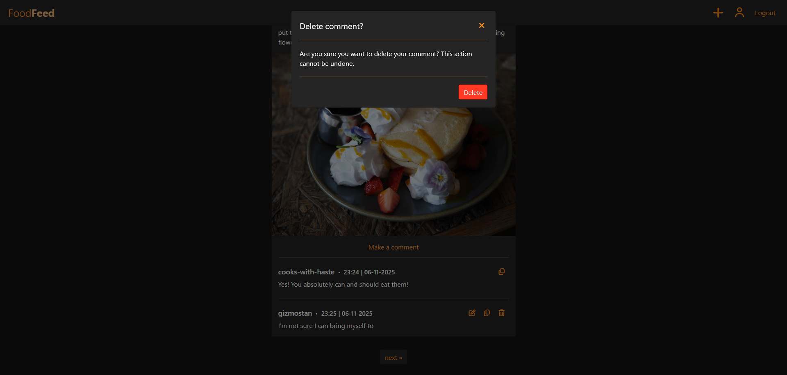 |

## File Validation

All code has been validated and found to have no errors. The results can be seen in the table below.

| Files validated   | Sample feedback   |
| ----------- | :------------: |
| <ul><li>mainfeed/create_comment.html</li><li>mainfeed/create_post.html</li><li>mainfeed/edit_post.html</li><li>mainfeed/edit_comment.html</li><li>mainfeed/index.html</li><li>mainfeed/view_comment.html</li><li>mainfeed/view_post.html</li><li>userprofile/profile.html</li><li>userprofile/edit_profile.html</li><li>templates/account/login.html</li><li>templates/account/logout.html</li><li>templates/account/signup.html</li></ul> | 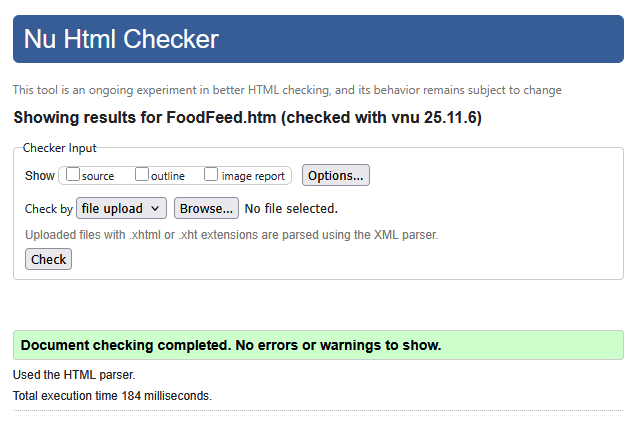 |
| <ul><li>styles.css</li></ul> |  |
| <ul><li>add_remove_image_logic.js</li><li>edit_delete_modal_content.js</li><li>enable_copy_to_clipboard.js</li><li>extend_profile_form_image_content.js</li></ul> |  |
| <ul><li>config/settings.py</li><li>config/urls.py</li><li>mainfeed/admin.py</li><li>mainfeed/forms.py</li><li>mainfeed/models.py</li><li>mainfeed/test_forms.py</li><li>mainfeed/test_views.py</li><li>mainfeed/urls.py</li><li>mainfeed/views.py</li><li>userprofile/admin.py</li><li>userprofile/forms.py</li><li>userprofile/models.py</li><li>userprofile/test_forms.py</li><li>userprofile/test_views.py</li><li>userprofile/views.py</li></ul> |  |

## Testing

### Site Evaluations

The tools rated the site highly except for Lighthouse's score for performance. The test was performed on the main feed, which contains high‑quality images. A delay in image rendering is sometimes visible on this page and on the profile view.

Cloudinary has documentation on [image optimisation](https://cloudinary.com/documentation/image_delivery_options), which did not seem to have an obvious fix, but would be a good start if I wanted to try to optimise image delivery. I did try looking at the platform's optimisation settings available on the website, but did not find that swapping the default encoding to chroma subsampling made a difference.

| Tool   | Scores   |
| ----------- | :------------: |
| Lighthouse - mobile |  |
| Lighthouse - desktop | 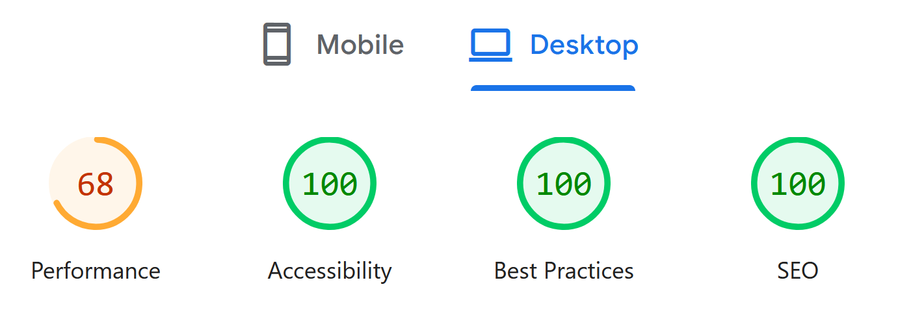 |
| Web Accessibility Evaluation Tool |  |

### Automated Test Suite

Testing was primarily achieved through unit tests that checked the processing of data and requests worked as intended. The test suite finds no errors and all 59 cases pass. It is worth noting that it takes a long time to complete the suite, which would be greatly reduced if the Cloudinary endpoint were mocked.

  

The unit test coverage is highlighted below, with levels of details depending on the complexity of the test cases. All forms and views were tested for various situations.

#### Forms

| Scenario | Coverage Comments |
| ----------- | ------------ |
| Forms receive valid data | <ul><li>Check correctly formatted data produces a valid form instance</li><li>Check the form accepts empty values for optional fields</li></ul> |
| Forms receive invalid data | <ul><li>Check incorrectly formatted data produces an invalid form instance</li><li>Check the form rejects missing required fields</li></ul> |

#### Post and Comment Views

The `CloudinaryField` used does not have file type validation or subclasses that define file types, so submitted images must be validated as images at the view level. As images are crucial to a post, an invalid image causes the submission to be rejected.

| Scenario | Coverage Comments |
| ----------- | ------------ |
| Get specific post or comment content | <ul><li>Verify expected response</li><li>Assert the rendered page has the expected content included</li></ul> |
| Get post or comment create and update pages | <ul><li>Verify expected response</li><li>Assert the rendered page has the expected content included</li><li>Check unauthorised users are redirected and provided the correct message</li></ul> |
| Submitting post or comment create and update requests | <ul><li>Verify expected response</li><li>Check unauthorised users are redirected and provided the correct message</li><li>Assert a valid submission results in expected changes and provides the correct message to the user</li><li>Assert submitted images of invalid file types cause the submission to be invalid</li><li>Assert an invalid submission is rejected with no changes made, and then provides the correct message(s) to the user</li></ul> |
| Deleting post or comment | <ul><li>Verify expected response</li><li>Check unauthorised users are redirected and provided the correct message</li><li>Assert an authorised request results in expected changes and provides the correct message to the user</li></ul> |

#### User and User Profile Views

The `CloudinaryField` used does not have file type validation or subclasses that define specific file types, so submitted images must be validated as images at the view level. Here, invalid images are ignored but do not cause the edit submission to be rejected.

| Scenario | Coverage Comments |
| ----------- | ------------ |
| New User creation also creates a corresponding User Profile object | <ul><li>Verify a user profile is made and its image and bio fields are set correctly</li></ul> |
| Get specific profile | <ul><li>Verify expected response</li><li>Assert the rendered page has the expected content included</li></ul> |
| Get profile editing page | <ul><li>Verify expected response</li><li>Assert the rendered page has the expected content included</li><li>Check unauthorised users are redirected and provided the correct message</li></ul> |
| Submitting profile create and update requests | <ul><li>Verify expected response</li><li>Check unauthorised users are redirected and provided the correct message</li><li>Assert a valid submission results in expected changes and provides the correct message(s) to the user</li><li>Assert an invalid submission is rejected with no changes made, and then provides the correct message(s) to the user</li></ul> |
| Profile image is not valid | <ul><li>Verify submitted images of invalid file types are ignored</li><li>Check the user is provided the correct message</li></ul> |
| Profile image removal toggled | <ul><li>Assert profile image is removed and submitted images are ignored</li></ul> |

### Manual Testing

Manual testing was used to check site responsiveness, buttons respond appropriately, and that everything generally works as expected. Of particular concern was the JavaScript used in the profile edit submission form.

The `CloudinaryField` used accepts files generally, rather than only images, so when rendering the profile edit form it would not visually display the current image. This and the remove image toggle were added through JavaScript after render. I believe this could also have been resolved with a custom widget defined in the `UserProfileForm`, but I didn't feel I had the time to figure out how that might work.

## Credits

Most assets used are my own, but the following were sourced externally:

* Site icons were sourced from [Font Awesome](https://fontawesome.com/)
* [Marigold Engevita](https://www.marigoldhealthfoods.co.uk/engevita) product image sourced from one of their [retailers](https://quickvit.co.uk/products/marigold-marigold-catering-engevita-b12-750g)
* [Garfield](https://models.spriters-resource.com/wii/thegarfieldshowthreatofthespacelasagna/asset/291793/) model asset image that appeared in [The Garfield Show: Threat of the Space Lasagna](https://en.wikipedia.org/wiki/The_Garfield_Show#Video_game)

## AI Usage

### AI assistance in code creation

I used GitHub Copilot to generate code such as HTML boilerplates, function doctsrings or for similar tasks that would be tedious to do by hand.

Sometimes this worked quite well, though I found text generated for docstrings would often miss things or unnecessarily hyper‑fixate on certain aspects.

### AI assistance in debugging code
GitHub Copilot was used to assist in debugging and suggesting approaches, with it really helping in filling in gaps that Django documentation, Cloudinary documentation and community discussion didn't seem to address.

### AI assistance in code optimisation and user experience
I asked the AI to perform checks for any typos or logical errors throughout. It noted the unit tests that were uploading images to Cloudinary didn't then delete the resource after test completeion. It suggested code that could be used to delete these resources and prevent issues.

It also helped with the design by suggesting an accent colour to visibly distinguish page content like buttons. It suggested warm colours such as orange, because users would associate it with warmth and because those colours are known to be able to stimulate our appetite.

### AI assistance in automated unit tests
I used AI to construct many of the form unit tests as these tests were straightforward. It was able to suggest negative cases I hadn't initially considered.

Unfortunately I didn't find it as useful for testing the views as it often made mistakes when handling the image fields. On a similar note, I had a lot of trouble constructing valid image data for testing and its recommendations were off‑topic or incorrect.

### AI assistance in the devlopment process and workflow

I found using AI to be rather mixed, with it being useful as a sounding board, but finding it often struggled to generate relevant suggestions in many situations. For simple use cases it was a great time saver, which enabled me to focus on 

It was sometimes really useful in situations where I had knowledge gaps as it was able to provide new leads to investigate.

## Adherence to Learning Objectives

| Learning Objective | How it had been achieved | README discussion (if applicable) |
| ----------- | ------------ |----------|
| 1.2 Database | User Profile model - the user can interact with this data by visiting their profile as shown in the [User Profile Page Buttons](#user-profile-page-buttons) section. | [User Profile Model](#user-profile-model) |
| 2.2 CRUD Functionality | Post and Comment delete operation now works | [Post and Comment CRUD](#post-and-comment-crud-features) [User Profile CRUD](#user-profile-crud-features) |
| 6.2 Document Deployment Process | Additional detail added | [Detailed deployment walkthrough](#detailed-walkthrough)|
| 7.1 Design and Implement a Custom Data Model | User Profile model - the user can interact with this data by visiting their profile as shown in the [User Profile Page Buttons](#user-profile-page-buttons) section. | [User Profile Model](#user-profile-model) |
| 8.1 Use AI tools to assist in code creation | Additional detail added  | [Code creation](#ai-assistance-in-code-creation) |
| 8.3 Use AI tools to optimize code for performance and user experience | Additional detail added  | [Code performance and UX](#ai-assistance-in-code-optimisation-and-user-experience) |
| 8.4 Use AI tools to create automated unit tests| Additional detail added  | [Automated testing](#ai-assistance-in-automated-unit-tests) |
| 8.5 Reflect on AI’s role in the development process and its impact on workflow | Additional detail added  | [Workflow impact](#ai-assistance-in-the-devlopment-process-and-workflow) |
