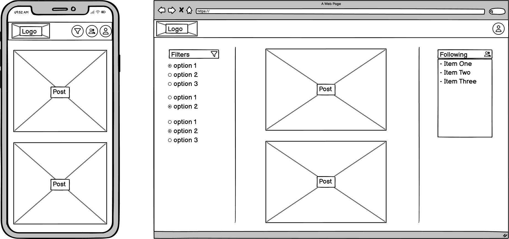

# FoodFeed

## CONTENTS

* [Purpose and Value](#Purpose-and-Value)
  * [Application Purpose](#Application-Purpose)
  * [User Value](#User-Value)

* [Design](#Design)
  * [Ideation and Styling](#Ideation-and-Styling)
  * [Website Features](#Website-Features)
  * [Database Structure](#Database-Structure)

* [Deployment](#Deployment)
  * [Procedure Outline](#Procedure-Outline)
  * [Securing of Sensitive Information](#Securing-of-Sensitive-Information)

* [Testing](#Testing)
  * [Automated-Testing](Automated-Testing)

* [Validation](#Validation)
  * [W3C Validator for HTML](#W3C-Validator-for-HTML)
  * [W3C Validator for CSS](#W3C-Validator-for-CSS)
  * [JSHint for JavaScript](#JSHint-for-JavaScript)
  * [Pylinter for Python](#Pylinter-for-Python)
  * [Lighthouse performance report](#Lighthouse-performance-report)
  * [WAVE accessibility report](#Wave-accessibility-report)

* [Credits](#Credits)
  

* [AI Usage](#AI-Usage)

- - -

## Purpose and Value

### Application Purpose
To demonstrate the ability to create a website where users can intuitively perform CRUD operations

### User Value

User stories were used to understand the features that would most benefit a user using, first having those that would produce an MVP, and then incrementally adding the features believed to offer the most value.

They were labeled according to the MoSCoW prioritisation system according to the following principles:
* `must-have` stories would inform the MVP for the website
* `should-have` stories would add additional core features
* `could-have` stories would improve the user experience

The MVP for this project was considered to be a basic social media feed wherein any user could browse all the posts ever made. They would be able to register for an account and then be able to create, edit and delete their own posts and comments. Additionally they would be able to create, update and delete an account profile picture.

This MVP would fufill CRUD operations and be a functional website, however it would lack features enabling users to better navigate the site and engage with other users. To that end `should-have` stories that would enable users to access view individual posts and follow other users were seen to be the most crucial. The `could-have` features would have similar motivation, but also would concern the functionality of the site as the amount of content scaled.

The project board can be accessed here: [FoodFeed project board](https://github.com/users/AmeliaBeep/projects/3/views/1)

## Design

### Ideation

The site name was chosen by considering the types of names other social media apps have. Many of their names are derived from core functionality or as a call to action. As a social media app centred around sharing and engaging with posts about food, FoodFeed was chosen to reflect that: afterfall it is a feed of food. Similarly the logo styling was designed to emphasise the "Feed" portion of the name and highlight the way content is presented as a feed.

Structurally the site was inspired by a mixture of Facebook, Reddit and Twitter, where they primarly all have a central feed and then supplementary features either on their navigation bar or on the sides of the main content. Their sites adapt to smaller screen sizes by moving their sidebar content to navigation bar icons or drop down menus. For FoodFeed it was similarly intended for the sidebar filters and follow list to become accessible through a dropdown found via icons that would prompt down-down menus.

The culture of Facebook food groups such as [Roast My Ugly Vegan Food](https://www.facebook.com/groups/834483857375137/) and subreddits like [r/shittyfoodporn](https://www.reddit.com/r/shittyfoodporn/) inspired users stories around allowing users to filter posts to depending on the appearance and taste of the food. A user was envisioned to have the capacity browse a feed of whatever combination of tags they want. For instance they could specifically seek "`ugly looking` but `tasty`" foods which is a popular post type in such communities.

### Wireframes

  

  

  

### Entity Relationship Diagrams

  

## Website Features !!!!!!!!!!!!!!!!!!

* Public home feed of the site's posts.
* Users can register an account and then log in to the site .
* Users can create, edit and delete their posts.
* Users can create, edit and delete their comments.
* Users can have a profile including:
  * The ability to update their username.
  * The ability to upload, update and remove a profile picture.
  * The ability to upload, update and remove a bio
  * Their post history.
* Users can access their profile through the navigation bar profile icon.
* View a user's profile through clicking on a content author's username.
* Access a post or comments' URL through a copy link button.

## Validation

## Testing

## Credit

## AI Usage